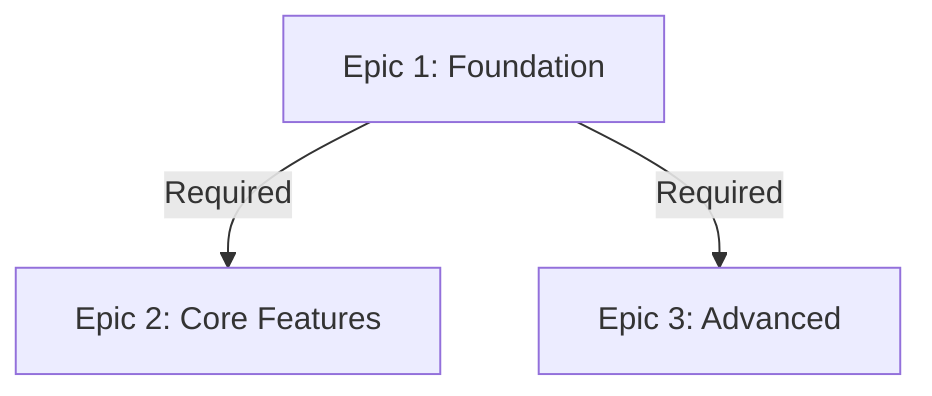
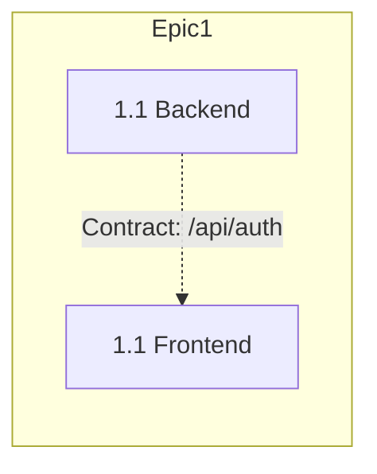
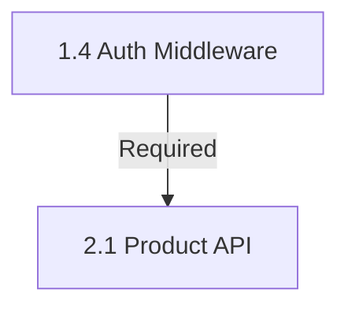

# <!-- Powered by BMAD™ Core -->

# Create Dependency Map Task

## Purpose

Generate visual dependency graphs showing epic/story relationships and parallel execution paths using Mermaid diagrams.

## When to Use

- After creating/updating PRD
- Before sprint planning
- When onboarding new developers
- To identify bottlenecks
- To communicate project structure

## Instructions

### 1. Gather Information

- Load PRD and extract Epic List + Epic Dependency Graph
- Load story files if they exist
- Extract "Dependencies and Parallelism" sections

### 2. Generate Epic-Level Dependency Graph

Create Mermaid flowchart:



Color code:
- Green: Foundation (no prerequisites)
- Blue: Parallel-ready epics
- Pink: Epics with multiple dependencies

### 3. Generate Story-Level Graphs

For each epic, show:
- Paired Backend/Frontend stories
- Data contracts binding pairs
- Cross-story dependencies



### 4. Generate Cross-Epic Dependencies

Show how stories from different epics depend on each other:



### 5. Generate Parallel Execution Timeline

Swimlane diagram showing Backend vs Frontend parallel work:

```mermaid
gantt
    title Backend vs Frontend Parallel Execution
    section Backend
    Epic 1 Backend :5d
    section Frontend  
    Epic 1 Frontend :5d
```

### 6. Create Contract Matrix

Table showing which contracts enable which story pairs:

| Data Contract | Backend Story | Frontend Story | Status |
|--------------|---------------|----------------|--------|
| /api/auth/login | 1.2 (Backend) | 1.2 (Frontend) | ✓ Defined |

### 7. Generate Team Allocation Suggestion

Recommend optimal team allocation based on dependencies:

```
Phase 1 (Day 1-5): Foundation
- Backend Team: Epic 1 Backend stories
- Frontend Team: Epic 1 Frontend stories (mocked)

Phase 2 (Day 6-9): Core Features
- Both teams work on Epic 2 and 3 in parallel
```

### 8. Create Summary Dashboard

Single-page dashboard with:
- Project stats
- Parallel opportunities
- Critical path
- Current blockers

### 9. Output All Visualizations

Save to `docs/dependency-map.md` with:
- Executive summary
- Epic-level dependencies
- Story-level dependencies by epic
- Cross-epic dependencies
- Parallel execution timeline
- Contract matrix
- Team allocation recommendations

## Success Criteria

- All epic/story relationships visualized
- Parallel execution paths identified
- Critical path highlighted
- Backend/Frontend pairing visible
- Data contracts linked to story pairs
- Team allocation suggestions actionable

## Notes

- READ-ONLY task
- Mermaid diagrams render in markdown viewers
- Update when PRD/stories change
- Share with all team members
- Split into multiple views if too complex
